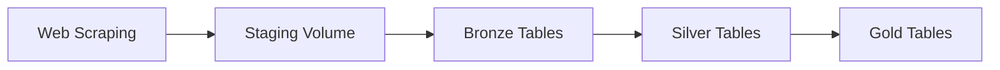

# Scraping Coto Documentation

Welcome to the Scraping Coto documentation! This project implements a data pipeline for scraping and processing data from Coto using Databricks and the Medallion Architecture.

## Overview

This project scrapes product data from Coto's website and processes it through a three-tier medallion architecture:

- **Bronze Layer**: Raw data ingestion from staging volumes
- **Silver Layer**: Cleaned and transformed data  
- **Gold Layer**: Business-ready aggregated data

## Features

- ✅ Automated data scraping from Coto
- ✅ Medallion architecture (Bronze, Silver, Gold)
- ✅ Databricks Asset Bundles for deployment
- ✅ Unity Catalog for data governance
- ✅ Delta Lake for ACID transactions
- ✅ Auto Loader for incremental data ingestion
- ✅ Streaming transformations

## Quick Start

### Installation

```bash
# Clone the repository
git clone https://github.com/yourusername/scraping_coto.git
cd scraping_coto

# Install dependencies
uv sync

# Deploy to Databricks
databricks bundle deploy -t dev
```

### Project Structure

```
scraping_coto/
├── src/scraping_coto/
│   ├── etl/
│   │   ├── staging/     # Data extraction
│   │   ├── bronze/      # Raw data ingestion
│   │   ├── silver/      # Data transformation
│   │   └── gold/        # Business aggregations
│   └── utils/           # Shared utilities
├── resources/           # Databricks job definitions
└── docs/               # Documentation
```

## Architecture

The pipeline follows the **Medallion Architecture**:



## Navigation

- [Code Reference](reference/) - Auto-generated API documentation
- [ETL Pipeline](reference/scraping_coto/etl/) - Data pipeline modules
- [Utilities](reference/scraping_coto/utils/) - Helper functions

## Contributing

Contributions are welcome! Please read our contributing guidelines before submitting PRs.

## License

This project is licensed under the MIT License.